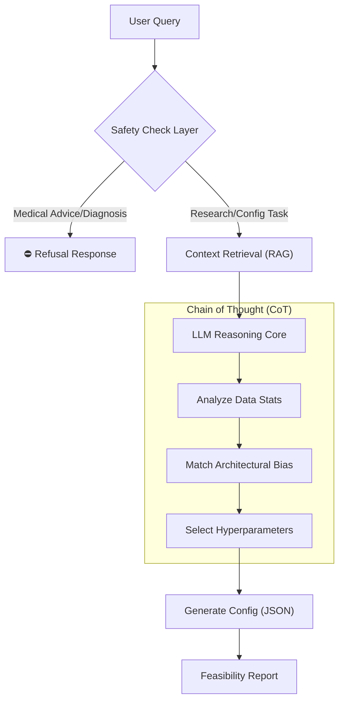

# Medical LLM Agent Playbook: Automated OCT Analysis Strategy

> **Project Vision:** Exploring how to integrate Large Language Models into medical-adjacent systems as **constrained components** rather than autonomous decision-makers.

## 1. Overview
In the field of Optical Coherence Tomography (OCT) analysis, selecting the right Deep Learning architecture (e.g., UNet vs. CS-Net) and training strategy is often a trial-and-error process heavily reliant on human experience.

This project prototypes an **LLM-driven Agent** acting as a "Senior Researcher Assistant". Instead of directly diagnosing patients, the Agent analyzes dataset metadata and task requirements to **autonomously recommend, configure, and explain** optimal Deep Learning strategies for researchers.

## 2. Design Philosophy: Safety First
This project adopts a "Human-in-the-Loop" (HITL) design principle. We explicitly define what the LLM **can** and **cannot** do:

### ⛔ Non-Goals (Strict Boundaries)
* **No Direct Diagnosis:** The system never outputs clinical diagnoses (e.g., "Patient has Glaucoma").
* **No Autonomous Advice:** The system never provides medical advice directly to patients.
* **No Unverified Execution:** All generated configurations must be reviewed by researchers before execution.

### ✅ Core Focus
* **Workflow Boundaries:** Restricting LLM generation to code configurations and experimental design.
* **Uncertainty Handling:** Designing prompts that force the model to say "I don't know" rather than hallucinating solutions.
* **Refusal over Hallucination:** Implementing strict guardrails to reject ambiguous or unsafe requests.

## 3. The Problem & Solution

| Pain Point in Medical AI | Agent Solution |
| :--- | :--- |
| **"Black Box" Tuning** | Provides explicit reasoning for model choices (e.g., *"Recommending Deep Supervision because the target lesions vary significantly in scale"*). |
| **Repetitive Experiments** | Automates the pipeline: `Data Analysis` -> `Config Generation` -> `Strategy Comparison`. |
| **Reproducibility** | Standardizes experimental setups via generated, version-controlled configuration files. |

## 4. System Architecture
The agent operates on a 3-stage **Chain-of-Thought (CoT)** flow:

1.  **Input Analysis:**
    * Task Type: (e.g., Fluid Segmentation, Layer Quantification)
    * Data Stats: (e.g., Class Imbalance Ratio, Noise Level, Resolution)
2.  **Reasoning Core (Gemini 1.5 Pro / GPT-4):**
    * Matches data features (e.g., *thin, disconnected layers*) to architectural biases (e.g., *Dilated Convolutions required*).
    * Suggests constrained hyperparameters (Loss Functions, Augmentation Pipelines).
3.  **Structured Output:**
    * Generates executable Python/YAML configurations for training frameworks (e.g., nnUNet).
    * Produces a "Feasibility Report" explaining the rationale.

### Architecture Flowchart

## 5. Roadmap
* [x] **Phase 1: Definition** - Domain analysis (OCT focus) and Safety Boundary definition.
* [x] **Phase 2: Prompt Engineering** - Developing System Prompts for "Senior Medical Consultant" persona with strict JSON output constraints.
* [ ] **Phase 3: Implementation** - Building the LangChain/LlamaIndex workflow to connect LLM reasoning with local Python execution.
* [ ] **Phase 4: Validation** - Benchmarking Agent recommendations against human expert choices in standard OCT datasets.

---
*Disclaimer: This project is an academic exploration of Foundation Models in healthcare workflows. It is NOT a medical device.*
